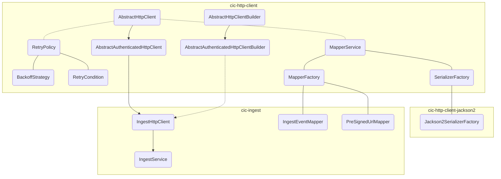

# cic-java-sdk

A Java SDK for interacting with Hyland CIC services, providing modular HTTP clients, extensible serialization/mapping, and high-level APIs for ingest operations.

---

## Architecture Overview



---

## Layered Architecture

### 1. HTTP Client Base Layer
- **Package:** `org.hyland.sdk.cic.http.client.base`
- Provides abstract classes for building HTTP clients:
  - `AbstractHttpClient` and `AbstractHttpClientBuilder`: Base for all HTTP clients.
  - `AbstractAuthenticatedHttpClient` and builder: Extend these to create new modules (e.g., cic-knowledge-discovery, cic-knowledge-enrichment) that require authentication.
- **How to extend:**
  - Create a new client class extending `AbstractAuthenticatedHttpClient`.
  - Implement a builder extending `AbstractAuthenticatedHttpClientBuilder`.

**Example:**
```java
public class KnowledgeDiscoveryHttpClient extends AbstractAuthenticatedHttpClient {
    public KnowledgeDiscoveryHttpClient(Builder builder) {
        super(builder);
    }
    // ...custom methods...
    public static class Builder extends AbstractAuthenticatedHttpClientBuilder<Builder, KnowledgeDiscoveryHttpClient> {
        public Builder(String baseUrl, AuthenticationHttpClient.Builder authBuilder) {
            super(baseUrl, authBuilder);
        }
        @Override
        public KnowledgeDiscoveryHttpClient build() {
            return new KnowledgeDiscoveryHttpClient(this);
        }
    }
}
```

---

### 2. Retry Policy
- **Package:** `org.hyland.sdk.cic.http.client.retry`
- Pluggable retry mechanism built into `AbstractHttpClient`. All HTTP client modules (cic-ingest, cic-agent, future modules) inherit retry support automatically.
- **Key classes:**
  - `RetryPolicy`: Configures retry behavior — max attempts, backoff strategy, and retry condition. Created via builder or static factories.
  - `BackoffStrategy`: Functional interface for computing delay between retries. Built-in: `fixedDelay(Duration)` and `exponentialDelay(Duration baseDelay, Duration maxDelay)` (full jitter).
  - `RetryCondition`: Functional interface determining whether a failed request should be retried. Composable via `and()`/`or()`. Built-in: `defaultCondition()` (retries idempotent methods on 408, 429, 500, 502, 503, 504, and `IOException`; non-idempotent methods are never retried) and `none()`.
  - `RetryContext`: Immutable context passed to conditions and strategies, containing attempt number, HTTP method, HTTP status code, and exception.

**Default behavior:**
When no retry policy is explicitly configured, `RetryPolicy.defaultPolicy()` is applied automatically:
- Max attempts: 3 (1 initial + 2 retries)
- Backoff: exponential with full jitter (100ms base delay, 20s max delay)
- Condition: retries idempotent methods on server errors (5xx), rate limiting (429), timeouts (408), and `IOException`; non-idempotent methods (POST, PATCH) are never retried

**Example: Default policy (applied automatically)**
```java
IngestHttpClient client = IngestHttpClient.from("https://api.example.com", authBuilder)
    .sourceId("my-source-id")
    .hxpEnvironment("my-hxp-environment")
    .build(); // default retry policy is applied
```

**Example: Custom retry policy**
```java
RetryPolicy policy = RetryPolicy.builder()
    .maxAttempts(5)
    .backoffStrategy(BackoffStrategy.fixedDelay(Duration.ofSeconds(2)))
    .retryCondition(context -> context.statusCode() == 503)
    .build();

IngestHttpClient client = IngestHttpClient.from("https://api.example.com", authBuilder)
    .sourceId("my-source-id")
    .hxpEnvironment("my-hxp-environment")
    .retryPolicy(policy)
    .build();
```

**Example: Disabling retries**
```java
IngestHttpClient client = IngestHttpClient.from("https://api.example.com", authBuilder)
    .sourceId("my-source-id")
    .hxpEnvironment("my-hxp-environment")
    .retryPolicy(RetryPolicy.none())
    .build();
```

---

### 3. Serialization/Mapping Layer
- **Package:** `org.hyland.sdk.cic.http.client.mapper`
- Centralized serialization and mapping via `MapperService`:
  - Uses Java SPI (`ServiceLoader`) to discover implementations of `SerializerFactory` (for marshallers like Jackson2) and `MapperFactory` (for business object mappers).
  - To contribute a new marshaller, implement `SerializerFactory` and register in `META-INF/services`.
  - To contribute a new mapper, implement `MapperFactory` for your business object (e.g., `IngestEvent`) and register it.

**Example: Registering a MapperFactory**
```java
public class IngestEventMapperFactory implements MapperService.MapperFactory {
    @Override
    public <T> CICMapper<T> getMapper(Class<T> type) {
        if (type == IngestEvent.class) {
            return (CICMapper<T>) new IngestEventMapper();
        }
        return null;
    }
}
```
Register the factory in `META-INF/services/org.hyland.sdk.cic.http.client.mapper.MapperService$MapperFactory`.

**Example: Registering a SerializerFactory (Jackson2)**
```java
public class Jackson2SerializerFactory implements MapperService.SerializerFactory {
    @Override
    public CICSerializer getSerializer() {
        return new Jackson2Serializer();
    }
}
```
Register the factory in `META-INF/services/org.hyland.sdk.cic.http.client.mapper.MapperService$SerializerFactory`.
See the `cic-http-client-jackson2` module for a full implementation.

**Best Practice:**
- Keep mappers and serializers stateless and thread-safe.
- Use SPI for easy extension and modularity.

**`CICBlob`:**
- **Package:** `org.hyland.sdk.cic.http.client.mapper.object`
- Represents a binary payload (content, digest, and optional content type/name/size) exchanged with CIC, e.g. when uploading a document via `IngestService`.
- `getInputStream()` is expected to return a **new** `InputStream` on every call, so the same `CICBlob` instance can be safely re-read (e.g. across upload retries).
- Build instances with `CICBlob.builder(...)` instead of writing an anonymous class — handy in tests and call sites alike:
  - `CICBlob.builder(String content)` — content encoded as UTF-8.
  - `CICBlob.builder(byte[] content)` — content is already available in memory.
  - `CICBlob.builder(Supplier<InputStream> inputStreamSupplier)` — for larger/streamed content (e.g. a `File`). The supplier is invoked each time `getInputStream()` is called, so it must produce a fresh stream every time rather than reusing an already-consumed one.
  - `CICBlob.builder(Path path)` — for a file-backed blob: content is streamed from disk on every `getInputStream()` call, and `name`/`size` are pre-filled from the file when available (still overridable).
- **Performance note:** the `Builder` is primarily meant for convenience (e.g. tests, small/one-off blobs). Integrations dealing with large files should implement `CICBlob` directly instead, so the content is only ever streamed from its source (e.g. disk) and never fully loaded into memory.

**Example: Building a CICBlob**
```java
CICBlob textBlob = CICBlob.builder("Hello, world!").contentType("text/plain").build();

byte[] content = Files.readAllBytes(path);
CICBlob fileBlob = CICBlob.builder(content)
    .contentType("application/pdf")
    .name("invoice.pdf")
    .digest("sha256:abc123")
    .build();

CICBlob streamedBlob = CICBlob.builder(Paths.get("invoice.pdf")).contentType("application/pdf").build();
```

**Example: Implementing CICBlob to stream a file without loading it into memory**
```java
public record FileCICBlob(Path path, String contentType, String digest) implements CICBlob {

    @Override
    public InputStream getInputStream() {
        try {
            return Files.newInputStream(path);
        } catch (IOException e) {
            throw new UncheckedIOException(e);
        }
    }

    @Override
    public Optional<String> getDigest() {
        return Optional.ofNullable(digest);
    }

    @Override
    public Optional<String> getContentType() {
        return Optional.ofNullable(contentType);
    }

    @Override
    public Optional<String> getName() {
        return Optional.of(path.getFileName().toString());
    }

    @Override
    public OptionalLong getSize() {
        try {
            return OptionalLong.of(Files.size(path));
        } catch (IOException e) {
            throw new UncheckedIOException(e);
        }
    }
}

CICBlob streamedFileBlob = new FileCICBlob(Paths.get("invoice.pdf"), "application/pdf", "sha256:abc123");
```

---

### 4. CIC Ingest Integration
- **Package:** `org.hyland.sdk.cic.ingest`
- Provides APIs for interacting with the CIC Ingest service:
  - `IngestService`: High-level API for ingest operations (e.g., uploading blobs, managing pre-signed URLs).
  - `IngestHttpClient`: Lower-level HTTP client, extends `AbstractAuthenticatedHttpClient` for direct HTTP interactions.

**Example Usage:**
```java
AuthenticationHttpClient.Builder authBuilder = AuthenticationHttpClient.from("my-token-uri")
    .clientId("my-client-id")
    .clientSecret("my-client-secret");

IngestHttpClient client = IngestHttpClient.from("https://ingestion.insight.dev.experience.hyland.com", authBuilder)
    .sourceId("my-source-id")
    .hxpEnvironment("my-hxp-environment")
    .build();
IngestService service = new IngestService(client);
service.uploadBlobIfNeeded(documentId, blob);
```

---

### 5. CIC Agent Integration
- **Package:** `org.hyland.sdk.cic.agent`
- Provides APIs for managing CIC agents and submitting questions to them:
  - `AgentService`: High-level API for agent lifecycle operations (create, read, update, delete), agent versioning, avatar management, LLM model and guardrail discovery, and question submission.
  - `AgentHttpClient`: Lower-level HTTP client, extends `AbstractAuthenticatedHttpClient` for direct HTTP interactions.
- **Design notes:**
  - Exposes a fluent, resource-oriented API. `AgentService.agent(agentId)` returns an `AgentResource` handle that scopes subsequent operations to a single agent without repeatedly passing the ID.
  - Integration-specific operations are available via `AgentService.integrations()`, which returns an `IntegrationAgentService`.
  - Mutating operations accept either a fully built request object or a `Consumer` of its builder for concise, inline configuration.

**Example Usage:**
```java
AgentHttpClient client = AgentHttpClient.from("https://discovery.dev.experience.hyland.com/agent", authBuilder)
    .hxpEnvironment("my-hxp-environment")
    .build();
AgentService service = new AgentService(client);

// Create an agent using a builder consumer
AgentConfiguration agent = service.createAgent(builder -> builder
    .name("Support Assistant")
    .description("Answers product support questions"));

// Submit a question via a resource handle
QuestionResponse response = service.agent(agent.id())
    .submitQuestion(request -> request.question("How do I reset my password?"));
```

---

### 6. CIC QnA Integration
- **Package:** `org.hyland.sdk.cic.qna`
- Provides APIs for question-and-answer and conversational interactions with CIC agents:
  - `QnaService`: High-level API for submitting questions, managing multi-turn conversations, retrieving answers and question history, and submitting feedback.
  - `QnaHttpClient`: Lower-level HTTP client, extends `AbstractAuthenticatedHttpClient` for direct HTTP interactions.
- **Design notes:**
  - Follows the same resource-oriented model as the Agent module. `QnaService.agent(agentId)`, `agent(agentId).conversation(conversationId)`, and `question(questionId)` return scoped resource handles for conversation, message, and question operations.
  - Integration-specific operations are available via `QnaService.integrations()`, which returns an `IntegrationQnaService`.
  - List operations return paginated responses and provide `*Paginator()` variants returning lazily-fetching iterables (`CursorPageIterable`, `PageIterable`) that fetch pages on demand.

**Example Usage:**
```java
QnaHttpClient client = QnaHttpClient.from("https://discovery.dev.experience.hyland.com/qna", authBuilder)
    .hxpEnvironment("my-hxp-environment")
    .build();
QnaService service = new QnaService(client);

// Start a conversation and send a follow-up message
StartConversationResponse started = service.agent(agentId)
    .startConversation(request -> request.question("How do I onboard a new team?"));
ConversationMessage message = service.agent(agentId)
    .conversation(started.conversation().id())
    .sendMessage(request -> request.question("What are the next steps?"));

// Iterate over all question history entries across pages
for (QuestionHistory entry : service.agent(agentId).getQuestionHistoryPaginator()) {
    // process entry
}
```

---

### 7. CIC Nucleus Integration
- **Package:** `org.hyland.sdk.cic.nucleus`
- Provides APIs for CIC Nucleus platform and identity operations, split across two authenticated HTTP clients:
  - `NucleusHttpClient`: Client for the System Integrations API. Wrapped by `SystemIntegrationService`, a high-level API for managing systems, groups, group members, and user mappings (including their attributes).
  - `NucleusIAMHttpClient`: Client for the Nucleus IAM API. Wrapped by `UsersService`, a high-level API for user lookup and enumeration.
- **Design notes:**
  - Both services follow the resource-oriented model. `SystemIntegrationService.system(systemId)` and `principalUser(principalUserId)` return scoped resource handles; list operations expose paginated responses with lazily-fetching `*Paginator()` variants.
  - **`UsersService` retrieves interactive users only.** The IAM API surfaces interactive users; `listUsers`, `listUsersPaginator`, and `getUser` return `InteractiveUser` instances and do not enumerate service or system accounts.

**Example Usage:**
```java
// System integration operations
NucleusHttpClient nucleusClient = NucleusHttpClient.from("https://api.platform.dev.app.hyland.com", authBuilder)
    .build();
SystemIntegrationService systems = new SystemIntegrationService(nucleusClient);
SystemOutputPage page = systems.listSystems();

// Interactive user lookup via the IAM API
NucleusIAMHttpClient iamClient = NucleusIAMHttpClient.from("https://auth.dev.app.hyland.com", authBuilder)
    .build();
UsersService users = new UsersService(iamClient);
for (InteractiveUser user : users.listUsersPaginator()) {
    // process interactive user
}
```

---

## Extending the SDK
- **New Modules:**
  - Extend `AbstractAuthenticatedHttpClient` and its builder for new CIC service modules.
- **Custom Serialization/Mapping:**
  - Implement and register `SerializerFactory` and `MapperFactory` for new formats or business objects.
- **Reference Classes:**
  - See `cic-http-client`, `cic-http-client-jackson2`, and `cic-ingest` modules for examples.

**Best Practices:**
- Use builders for configuration and instantiation.
- Register SPI implementations for modularity.
- Write unit tests for custom mappers and clients.

---

## Audience
This SDK is designed for:
- **SDK Users:** Developers integrating Hyland CIC services into their Java applications.
- **Contributors:** Developers extending the SDK with new modules, mappers, or marshallers.

---

## Build & Test
- The project uses Maven for build and test automation.
- GitHub Actions workflow (`.github/workflows/build.yml`) compiles and tests the SDK on push and pull requests.

---

## License
Licensed under the Apache License, Version 2.0.

---

## Contributions
Contributions are welcome! Please open issues or pull requests for improvements or new features.
