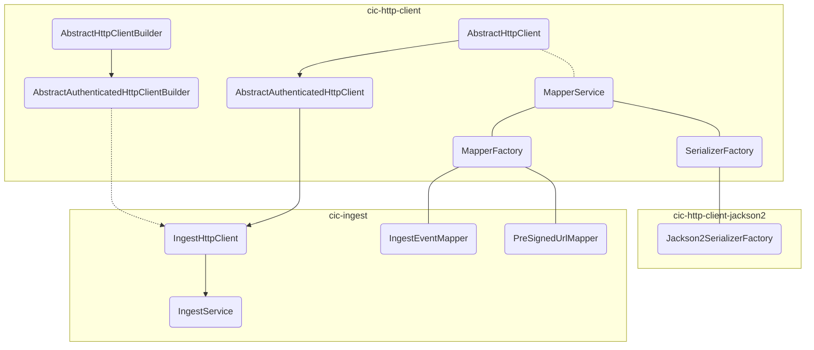

# cic-java-sdk

A Java SDK for interacting with Hyland CIC services, providing modular HTTP clients, extensible serialization/mapping, and high-level APIs for ingest operations.

---

## Architecture Overview



---

## Layered Architecture

### 1. HTTP Client Base Layer
- **Package:** `org.hyland.sdk.cic.http.client.base`
- Provides abstract classes for building HTTP clients:
  - `AbstractHttpClient` and `AbstractHttpClientBuilder`: Base for all HTTP clients.
  - `AbstractAuthenticatedHttpClient` and builder: Extend these to create new modules (e.g., cic-knowledge-discovery, cic-knowledge-enrichment) that require authentication.
- **How to extend:**
  - Create a new client class extending `AbstractAuthenticatedHttpClient`.
  - Implement a builder extending `AbstractAuthenticatedHttpClientBuilder`.

**Example:**
```java
public class KnowledgeDiscoveryHttpClient extends AbstractAuthenticatedHttpClient {
    public KnowledgeDiscoveryHttpClient(Builder builder) {
        super(builder);
    }
    // ...custom methods...
    public static class Builder extends AbstractAuthenticatedHttpClientBuilder<Builder, KnowledgeDiscoveryHttpClient> {
        public Builder(String baseUrl, AuthenticationHttpClient.Builder authBuilder) {
            super(baseUrl, authBuilder);
        }
        @Override
        public KnowledgeDiscoveryHttpClient build() {
            return new KnowledgeDiscoveryHttpClient(this);
        }
    }
}
```

---

### 2. Serialization/Mapping Layer
- **Package:** `org.hyland.sdk.cic.http.client.mapper`
- Centralized serialization and mapping via `MapperService`:
  - Uses Java SPI (`ServiceLoader`) to discover implementations of `SerializerFactory` (for marshallers like Jackson2) and `MapperFactory` (for business object mappers).
  - To contribute a new marshaller, implement `SerializerFactory` and register in `META-INF/services`.
  - To contribute a new mapper, implement `MapperFactory` for your business object (e.g., `IngestEvent`) and register it.

**Example: Registering a MapperFactory**
```java
public class IngestEventMapperFactory implements MapperService.MapperFactory {
    @Override
    public <T> CICMapper<T> getMapper(Class<T> type) {
        if (type == IngestEvent.class) {
            return (CICMapper<T>) new IngestEventMapper();
        }
        return null;
    }
}
```
Register the factory in `META-INF/services/org.hyland.sdk.cic.http.client.mapper.MapperService$MapperFactory`.

**Example: Registering a SerializerFactory (Jackson2)**
```java
public class Jackson2SerializerFactory implements MapperService.SerializerFactory {
    @Override
    public CICSerializer getSerializer() {
        return new Jackson2Serializer();
    }
}
```
Register the factory in `META-INF/services/org.hyland.sdk.cic.http.client.mapper.MapperService$SerializerFactory`.
See the `cic-http-client-jackson2` module for a full implementation.

**Best Practice:**
- Keep mappers and serializers stateless and thread-safe.
- Use SPI for easy extension and modularity.

---

### 3. CIC Ingest Integration
- **Package:** `org.hyland.sdk.cic.ingest`
- Provides APIs for interacting with the CIC Ingest service:
  - `IngestService`: High-level API for ingest operations (e.g., uploading blobs, managing pre-signed URLs).
  - `IngestHttpClient`: Lower-level HTTP client, extends `AbstractAuthenticatedHttpClient` for direct HTTP interactions.

**Example Usage:**
```java
IngestHttpClient client = IngestHttpClient.from("https://ingestion.insight.dev.experience.hyland.com")
    .clientId("your-client-id")
    .clientSecret("your-client-secret")
    .build();
IngestService service = new IngestService(client);
service.uploadBlobIfNeeded(documentId, blob);
```

---

## Extending the SDK
- **New Modules:**
  - Extend `AbstractAuthenticatedHttpClient` and its builder for new CIC service modules.
- **Custom Serialization/Mapping:**
  - Implement and register `SerializerFactory` and `MapperFactory` for new formats or business objects.
- **Reference Classes:**
  - See `cic-http-client`, `cic-http-client-jackson2`, and `cic-ingest` modules for examples.

**Best Practices:**
- Use builders for configuration and instantiation.
- Register SPI implementations for modularity.
- Write unit tests for custom mappers and clients.

---

## Audience
This SDK is designed for:
- **SDK Users:** Developers integrating Hyland CIC services into their Java applications.
- **Contributors:** Developers extending the SDK with new modules, mappers, or marshallers.

---

## Build & Test
- The project uses Maven for build and test automation.
- GitHub Actions workflow (`.github/workflows/build.yml`) compiles and tests the SDK on push and pull requests.

---

## License
Licensed under the Apache License, Version 2.0.

---

## Contributions
Contributions are welcome! Please open issues or pull requests for improvements or new features.
